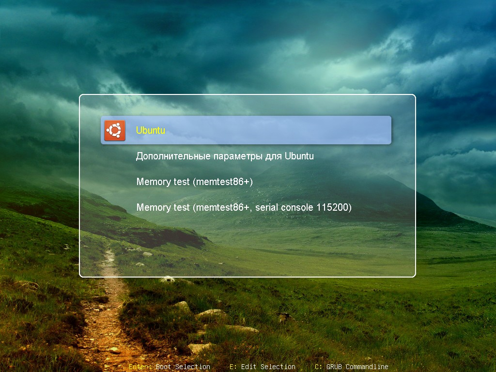
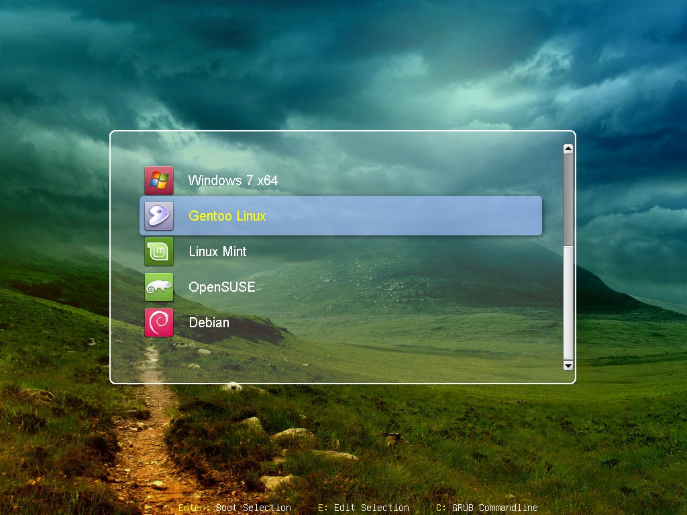
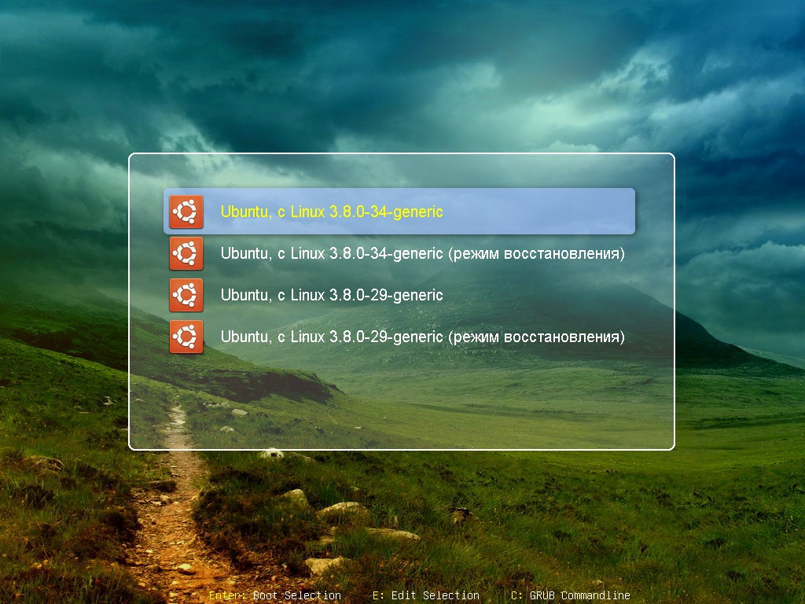
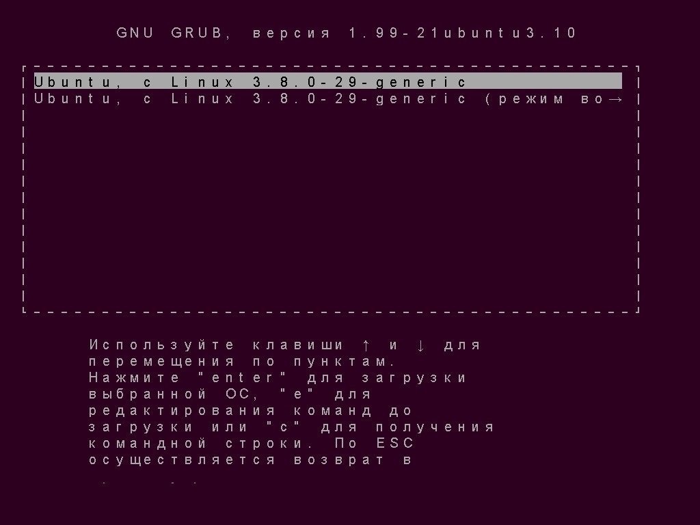
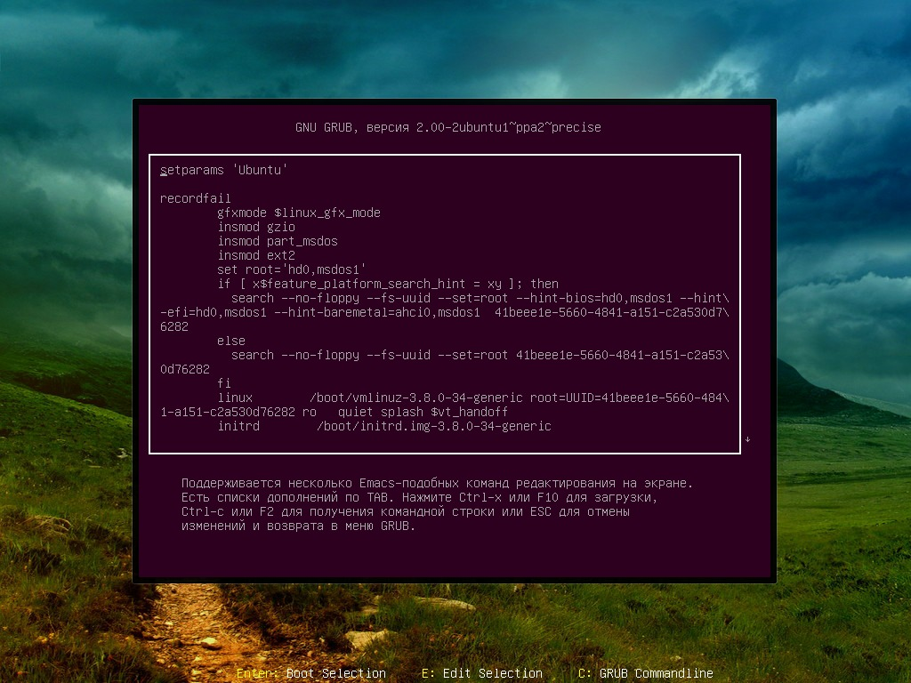

Grub2 gfxmenu theme "Powerman"
==============================

Designed for 1024x768 resolution.

Works with Grub-2.02, 2.00, partially works with 1.99 (submenu not styled).

## Install

Download theme (make sure your /boot/ is mounted first, if it's on separate partition):

    sudo mkdir -p /boot/grub/themes/    # create dir if not exists
    sudo git clone https://github.com/powerman/grub2-theme-powerman.git /boot/grub/themes/Powerman

then edit `/etc/default/grub` to set these values:

    GRUB_GFXMODE="1024x768x32"
    GRUB_GFXPAYLOAD_LINUX="text"        # optional, if you've troubles booting linux
    GRUB_THEME="/boot/grub/themes/Powerman/theme.txt"

and update grub configuration:

    sudo update-grub                    # or: sudo update-grub2

## Screenshots

Main menu without scroll (5 items or less):

Main menu with scroll (more than 5 items):

Submenu menu (grub-2.00):

Submenu menu (grub-1.99):

Edit menu item / command prompt:

## Credits

Theme images are taken from other themes:
- box_white_trans_*       from "starfield"
- box_transblack_*        from "starfield"
- select_transblue_*      from "proto"
- scrollbar_cleanwhite_*  from "winter"

Background image is from unknown source.
